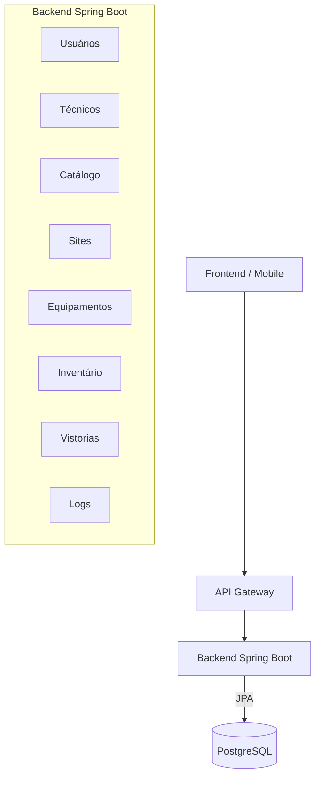
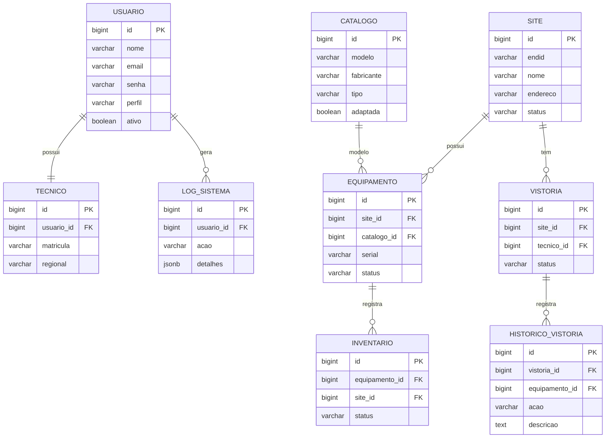
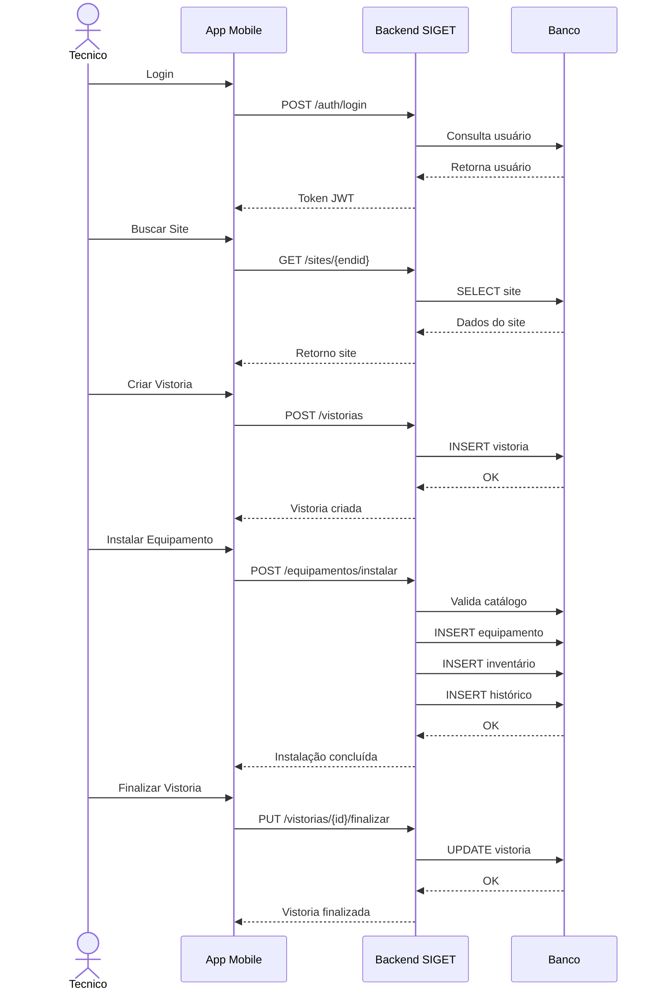
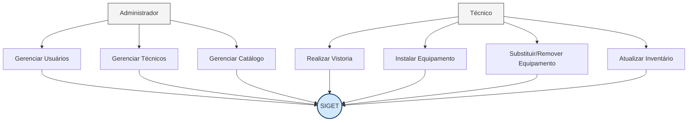
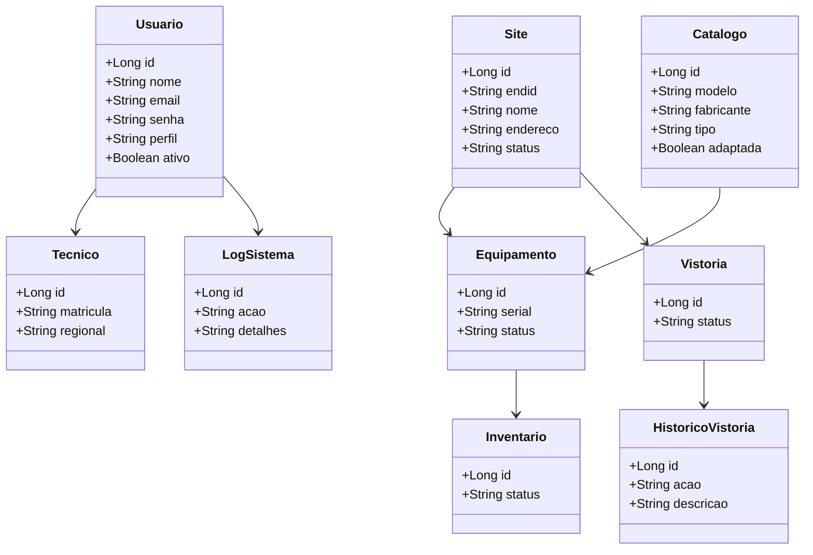

### **📘 DOCUMENTAÇÃO COMPLETA – SIGET**

**Sistema Integrado de Gestão de Equipamentos e Telecom**

---

### **🟦 1. Nome do Projeto**

**SIGET – Sistema Integrado de Gestão de Equipamentos e Telecom**

---

### **🟦 2. Descrição Geral**

O SIGET é um backend corporativo desenvolvido em Java 25 + Spring Boot, utilizando PostgreSQL como banco de dados relacional.

O sistema foi projetado para:

   - gerenciar inventário de equipamentos
   - registrar vistorias técnicas
   - controlar instalação, remoção e substituição
   - manter catálogo padronizado
   - garantir auditoria completa
   - centralizar regras de negócio

---

### **🟦 3. Objetivos do Projeto**

   - Criar um backend robusto, seguro e escalável
   - Garantir integridade e rastreabilidade dos dados
   - Padronizar modelos e fabricantes
   - Automatizar inventário
   - Registrar histórico detalhado de ações
   - Fornecer APIs REST padronizadas
   - Facilitar integração com sistemas externos

---

### **🟦 4. Escopo**

Inclui:

   - Backend completo
   - APIs REST
   - Banco PostgreSQL
   - Regras de negócio
   - Auditoria
   - Inventário
   - Vistorias
   - Catálogo
   - Usuários e técnicos

Não inclui:

   - Frontend
   - Aplicativo mobile
   - Dashboards

---

### **🟦 5. Arquitetura do Sistema**

        FRONTEND (qualquer)
        │
        ▼
        API GATEWAY
        │
        ▼
        SPRING BOOT BACKEND
        ├── Usuários
        ├── Técnicos
        ├── Catálogo
        ├── Sites
        ├── Equipamentos
        ├── Inventário
        ├── Vistorias
        └── Logs
        │
        ▼
        POSTGRESQL

---

### **🟦 6. Tecnologias Utilizadas**

   - Java 25
   - Spring Boot 3.x
   - Spring Web
   - Spring Data JPA
   - Spring Security (JWT)
   - PostgreSQL
   - Flyway
   - Lombok
   - Validation (Jakarta)
   - Swagger / SpringDoc OpenAPI

---

### **🟦 7. Dependências Essenciais (com justificativas)**

**Spring Web**

Permite criar APIs REST, controllers e rotas. Sem ele, o backend não expõe endpoints.

**Spring Data JPA**

Simplifica o acesso ao banco e reduz código. Essencial para o modelo relacional do SIGET.

**PostgreSQL Driver**

Driver JDBC para conectar ao banco. Sem ele, o backend não acessa o PostgreSQL.

**Spring Security**

Responsável pela autenticação e autorização via JWT.

**Validation (Jakarta)**

Valida DTOs automaticamente.

Evita dados inválidos no banco.

**Lombok**

Reduz código repetitivo (getters, setters, builders).

**DevTools**

Acelera o desenvolvimento com reload automático.

**Flyway**

Versiona o banco de dados e garante consistência entre ambientes.

**SpringDoc OpenAPI**

Gera documentação automática das APIs (Swagger).

---

### **🟦 8. Modelagem de Dados – DER**

    ┌──────────────┐        1 ── 1        ┌──────────────┐
    │   USUARIO    │──────────────────────│   TECNICO    │
    └──────────────┘                      └──────────────┘
    │ 1                                     
    │ N                                    
    ▼                                      
    ┌──────────────┐        1 ── N        ┌──────────────────┐
    │ LOG_SISTEMA  │──────────────────────│     USUARIO      │
    └──────────────┘                      └──────────────────┘
    
    ┌──────────────┐        1 ── N        ┌──────────────────┐
    │    SITE      │──────────────────────│   EQUIPAMENTO    │
    └──────────────┘                      └──────────────────┘
    │ 1
    │ N
    ▼
    ┌──────────────┐
    │  INVENTARIO  │
    └──────────────┘
    
    ┌──────────────┐        1 ── N        ┌──────────────────┐
    │    SITE      │──────────────────────│    VISTORIA      │
    └──────────────┘                      └──────────────────┘
    │ 1
    │ N
    ▼
    ┌────────────────────┐
    │ HISTORICO_VISTORIA │
    └────────────────────┘
    
    ┌──────────────┐        1 ── N        ┌──────────────────┐
    │   CATALOGO   │──────────────────────│   EQUIPAMENTO    │
    └──────────────┘                      └──────────────────┘

---

### **🟦 9. Tabelas do Banco de Dados**

---

### **🟦 10. Diagrama de Sequência – Fluxo de Instalação** 

---

## **🟦 11. Diagrama de Caso de Uso**

---

## **🟦 12. Diagrama de Classes**

---

### **🟦 13. Introdução aos Requisitos**

Os requisitos do SIGET definem o comportamento esperado do sistema e servem como base para orientar o desenvolvimento, garantir alinhamento entre as áreas envolvidas e permitir validação futura.

Eles foram organizados em:

   - Requisitos Funcionais (RF): o que o sistema deve fazer.

   - Requisitos Não Funcionais (RNF): como o sistema deve se comportar.
---

### **🟦 14. Requisitos Funcionais (RF)**

- RF01 – Autenticação via JWT
- RF02 – Gerenciamento de usuários
- RF03 – Gerenciamento de técnicos
- RF04 – Catálogo de equipamentos
- RF05 – Consulta e cadastro de site
- RF06 – Instalação de equipamentos
- RF07 – Remoção de equipamentos
- RF08 – Substituição de equipamentos
- RF09 – Atualização de equipamentos
- RF10 – Regra de adaptação da fonte
- RF11 – Inventário automático
- RF12 – Vistorias
- RF13 – Histórico de vistoria
- RF14 – Logs de auditoria
- RF15 – Serial automático
- RF16 – Validação de catálogo
- RF17 – Site não ativo

### **🟦 15. Requisitos Não Funcionais (RNF)**

(lista completa com Guided Links)

- RNF01 – Segurança
- RNF02 – Integridade dos dados
 - RNF03 – Escalabilidade
- RNF04 – Disponibilidade
 - RNF05 – Padrão REST
- RNF06 – Auditoria completa
- RNF07 – Independência do frontend
- RNF08 – Performance adequada
- RNF09 – Tolerância a falhas

---

### **🟦 16. Fluxos Operacionais**
#### Fluxo do Técnico

- Login
- Buscar site
- Criar vistoria
 - Instalar/remover/substituir equipamentos
 - Finalizar vistoria
 - Inventário atualizado automaticamente

#### Fluxo do Administrador

- Criar usuários
- Criar técnicos
- Criar catálogo
- Atualizar catálogo
- Consultar logs

### **🟦 16. Licença**

O projeto utiliza a Licença MIT.